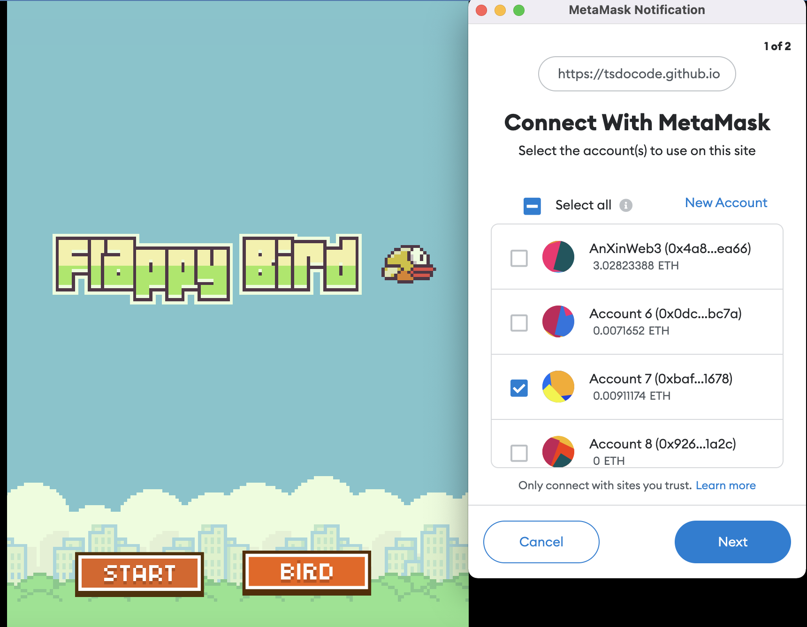

# Flappy Bird meet NFT & Blockchain
> by
tsdocode

## Introduction

Customize classic Flappy Bird game with Blockchain back-end

## Technology

- Game engine: [Playcanvas](https://developer.playcanvas.com/en/)
- Blockchain:
  - Local test network: [Ganache](https://trufflesuite.com/ganache/)
  - Public test network: [Rinkeby](https://www.rinkeby.io/)
  - Smart contract tool: [Truffle](https://trufflesuite.com/)
  - NFT: [Openzeppelin](https://www.openzeppelin.com/)

## Game Architecture

## Game Play

## Game features
- Lucky draw bird
- Buy bird via Opensea
- Reward when complete game
  - bonus based on bird's rare

## Bird Attributes
- **Rare**:
  - Normal: 50%
  - Rare: 30%
  - Epic: 20%
  - Legendary: 10%
- **Bonus**:
  - Normal: 0%
  - Rare: 20%
  - Epic: 30%
  - Legendary: 100%
- **Max Stamina**:
  - Normal: 999
  - Rare: 300
  - Epic: 200
  - Legendary: 20

## Luckydraw
This is not a secure random method, I will update later.

1. Random number in js
2. Random rare base on this number in smart contract
3. Random bird base on this rare in smart contract
4. Mint bird to player

## How to play

1. Install Metamask Extension to your browser
2. Connect To Rinkeby network
> RPC url: https://rinkeby.infura.io/v3/e0517a061de2466ba6b7569c29f02967

> Network Id: 4
3. Faucet some fake ETHs using [chainlink faucet](https://faucets.chain.link/)
4. Game was deployed to [my github page](https://tsdocode.github.io/NFlappyT/)
5. Lucky draw some birds
6. Enjoy

## References

[Flappy Bird - Dong Nguyen](https://vi.wikipedia.org/wiki/Flappy_Bird)
[Original Flappy Bird based on Play Canvas](https://developer.playcanvas.com/en/tutorials/flappy-bird/)
[Buildspace NFT Game guide](https://buildspace.so/p/CO5cc2751b-e878-41c4-99fa-a614dc910ee9)
